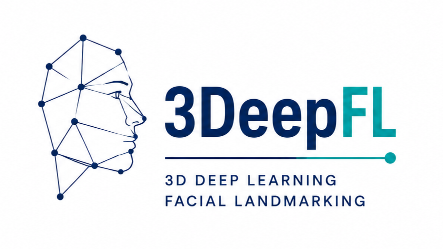
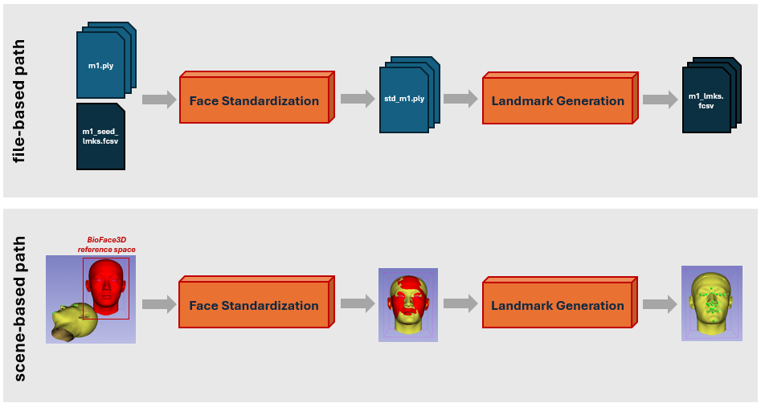
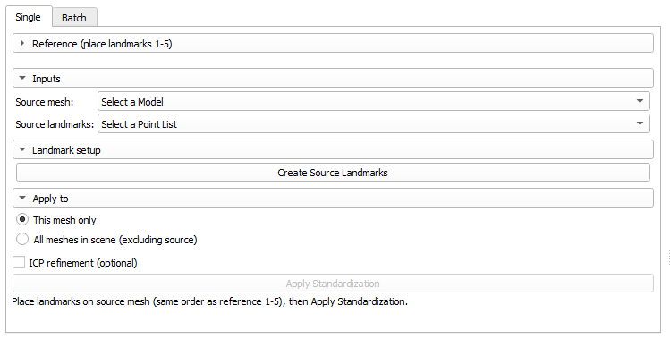
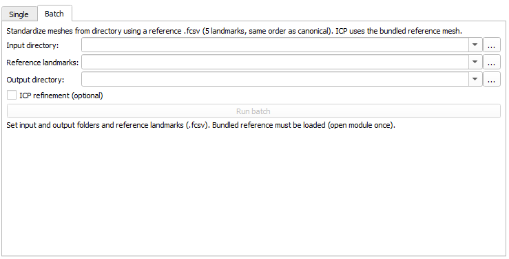
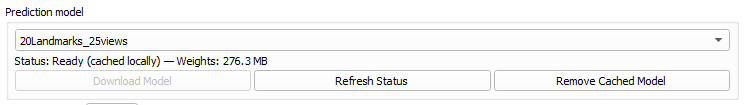
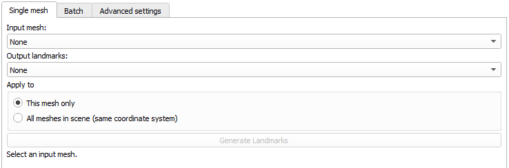
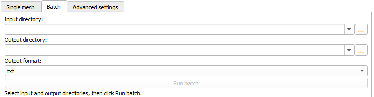
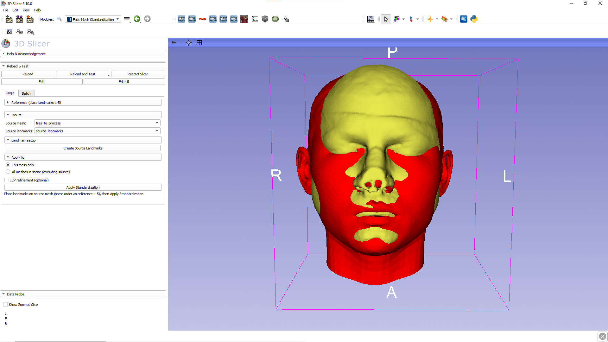

# 3DeepFL — 3D Deep Learning Facial Landmarking

3D Slicer extension for automatic **3D facial landmark** prediction on surface meshes.
Includes a **mesh standardization** step to align meshes to the reference space expected by the bundled MVCNN models (**required for most meshes**).

## Overview

**3DeepFL** integrates deep learning-based facial landmarking into 3D Slicer and adds a standardization step to align your mesh to the reference space used by the models.

The landmarking models and reference space follow the **BioFace3D** pipeline (Module 2: homologous landmark registration), described in the original end-to-end software ([Heredia-Lidón *et al.*, 2025](https://doi.org/10.1016/j.cmpb.2025.109010); [upstream software and weights](https://bitbucket.org/cv_her_lasalle/bioface3d)). BioFace3D Module 1 (MRI → 3D face mesh) and Module 3 (morphometric biomarkers) are outside this extension.

## Quick start

1. Standardize your mesh (or meshes) using **Face standardization**.
2. Run **Landmark generation** on the standardized mesh (or meshes).

> When can I skip standardization?
>
> Only if your mesh is already in the **BioFace3D canonical/reference space** — for example, if it was generated by the original BioFace3D pipeline **Module 1** (MRI → 3D face mesh). For typical third-party meshes (PLY/OBJ/STL/VTK/WRL), standardization is crucial for reliable predictions (and often for prediction to work at all).

## Step 1: Face standardization
This module aligns your face mesh(es) to the bundled reference using manually placed correspondences.
It computes a similarity transform (rotation, translation, uniform scale) from **exactly 5 seed landmarks** and applies it to the mesh(es).
Optionally, it can run ICP refinement to further align the surface.

### Single mesh (scene mode)

1. Open **Face standardization**.
2. Select your **source mesh** (the mesh where you will place the 5 seed landmarks).
3. Click **`Create Source Landmarks`**.
4. Use the **reference guide image shown in the module UI** to place **exactly 5** landmarks on the source mesh in this order:
   1. Outer right eye
   2. Glabella
   3. Outer left eye
   4. Nose tip
   5. Chin
5. Choose **`Apply to`**:
   - **This mesh only**
   - **All meshes in scene (excluding source)**
6. (Optional) Enable **`ICP refinement (optional)`**:
   - Recommended only for clean surface meshes.
   - The UI warns ICP may worsen meshes with internal structures (for example MRI meshes).
7. Click **`Apply Standardization`**.

### Batch (directory mode)

Batch mode computes **one** similarity transform from a reference `.fcsv` (5 landmarks, order 1-5) and applies it to every mesh file in the input directory.

1. Go to the **Batch** tab.
2. Set:
   - **Input directory**: `.ply`, `.obj`, `.vtk`, `.stl`
   - **Reference landmarks**: `.fcsv` with exactly 5 points, ordered as in the UI reference guide image: (1) outer right eye, (2) glabella, (3) outer left eye, (4) nose tip, (5) chin
   - **Output directory**
3. (Optional) Enable batch **ICP refinement (optional)**.
4. Click **`Run batch`**.

## Step 2: Landmark generation
This module runs the bundled MVCNN landmarking pipeline inside Slicer.
It renders the surface from multiple views, predicts landmark heatmaps for each view, and combines these predictions into a single set of 3D landmarks on the mesh surface.

### Models and weights

- The **Model** selector lists the configs shipped under `mvcnn/__configs/`.
- If the selected model weights are not cached locally, click **`Download Model`** in the “Prediction model” panel.
- Downloaded weights are stored in a local cache (`~/.3deepfl_mvcnn/models`) and reused on later runs.

### Single mesh (scene mode)

1. Open **Landmark generation**.
2. (Important) Use the mesh(es) you standardized in **Step 1**.
3. Select:
   - **Input mesh**
   - **Output landmarks** (vtk fiducial node)
4. Choose whether to process:
   - **This mesh only**
   - **All meshes in scene** (ensure meshes are standardized)
5. Select a **Model** (download weights if needed).
6. (Optional) Tune **Advanced settings**:
   - **Max Ransac Error** (lower = stricter; default `5`)
   - **Mean Predictions** (default `1`; more = more stable but slower)
   - **Max Tries** (default `3`)
7. Click **`Generate Landmarks`**.

### Batch (directory mode)

Batch processes mesh files in a folder and saves landmark files to an output directory.

1. Go to the **Batch** tab.
2. Set:
   - **Input directory**: `.ply`, `.obj`, `.stl`, `.vtk`, `.wrl`
   - **Output directory**
3. Select a **Model** and ensure it is available locally (download if needed).
4. Choose **Output format**: `txt`, `fcsv`, `landmarkAscii`, or `all`.
5. Click **`Run batch`**.

Outputs are written as: `<mesh_stem>_landmarks.*`.

### Python dependencies and GPU acceleration

On first use, Slicer may install missing Python dependencies into its own Python environment (PyTorch and SciPy).
If you have an NVIDIA GPU, you can optionally install **GPU-enabled PyTorch** from the **Advanced settings** tab.
After installing GPU-enabled PyTorch, quit and restart 3D Slicer and re-check that the status shows **Using GPU**.
Model weights are downloaded on demand (click **`Download Model`**) and then reused from the local cache. Once dependencies and weights are available, landmarking runs fully locally.

## Requirements

Use a supported 3D Slicer version for this extension.

The extension installs the following Python dependencies into Slicer’s bundled Python:
- `torch>=2.6.0,<2.11`
- `scipy>=1.7.0`

If your Slicer’s Python version/platform does not have compatible wheels available for these pinned ranges, dependency installation may fail and landmarking may not run.

For NVIDIA GPU acceleration, the extension installs GPU-enabled PyTorch from the CUDA **cu124** wheel index.

## Troubleshooting (common issues)

- **Model not available**: in **Landmark generation**, choose a model and click **`Download Model`** if the UI indicates it is not cached.
- **Import errors for `torch` / `scipy`**: the extension tries to install dependencies automatically, but restricted environments may require manual setup (the UI will show the underlying error).
- **Slow performance**: enable GPU-enabled PyTorch in **Advanced settings** (NVIDIA only), then restart Slicer and confirm the status shows **Using GPU**.
- **Landmarks look wrong / prediction fails**:
  - Make sure you ran **Step 1 (Face standardization)** on the same mesh(es) you are predicting on (single mesh, **All meshes in scene**, or batch).
  - Re-check the **5 seed landmark order** used for standardization (use the reference guide image in the module UI).
  - To sanity-check alignment, compare your standardized mesh to the **bundled reference** (it is loaded into the scene by the standardization module but hidden by default; you can show/hide it from the Data/Subject Hierarchy tree).

## Screenshots

Face standardization: before and after template alignment.

| Before | After |
|--------|-------|
|  |  |

Landmark generation: result after landmark prediction.

## Citation

If you use the underlying **BioFace3D** methods or models in research, please cite:

> Heredia-Lidón Á, Echeverry-Quiceno LM, González A, Hostalet N, Pomarol-Clotet E, Fortea J, Fatjó-Vilas M, Martínez-Abadías N, Sevillano X; Alzheimer’s Disease Neuroimaging Initiative. BioFace3D: An end-to-end open-source software for automated extraction of potential 3D facial biomarkers from MRI scans. Comput Methods Programs Biomed. 2025 Nov;271:109010. doi: 10.1016/j.cmpb.2025.109010. Epub 2025 Aug 9. PMID: 40818363.

Links: [ScienceDirect](https://www.sciencedirect.com/science/article/pii/S0169260725004274) · [PubMed](https://pubmed.ncbi.nlm.nih.gov/40818363/) · [DOI](https://doi.org/10.1016/j.cmpb.2025.109010)

## License and patents

Released under the [MIT License](LICENSE).

To the best of our knowledge, this extension is not covered by asserted patents. If you are aware of a relevant patent claim, please open an issue so the catalog text can be updated.
